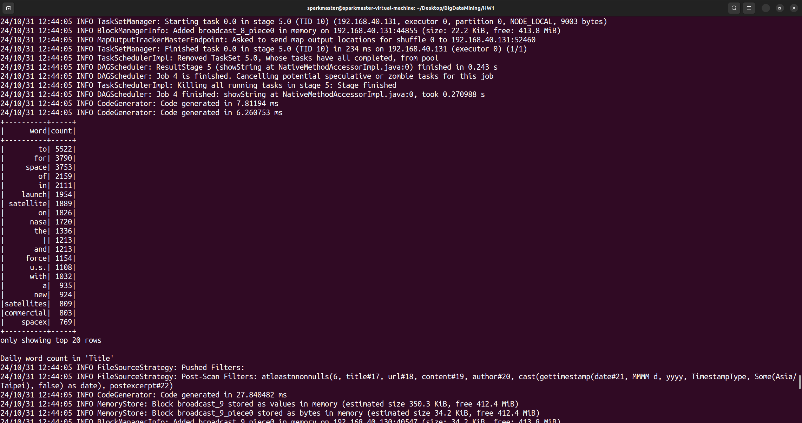
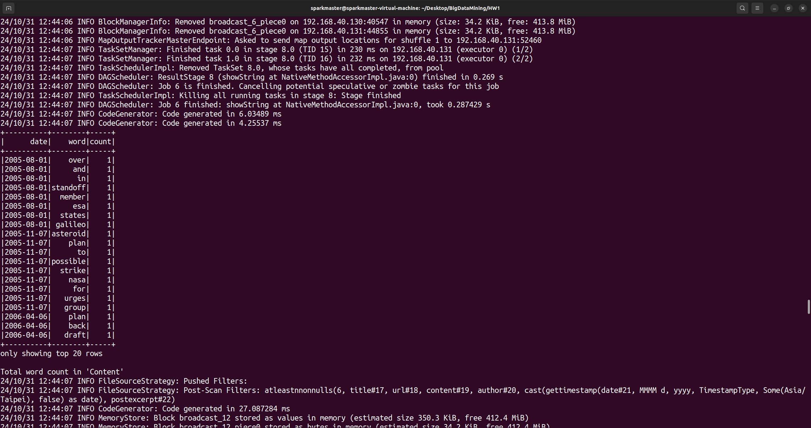
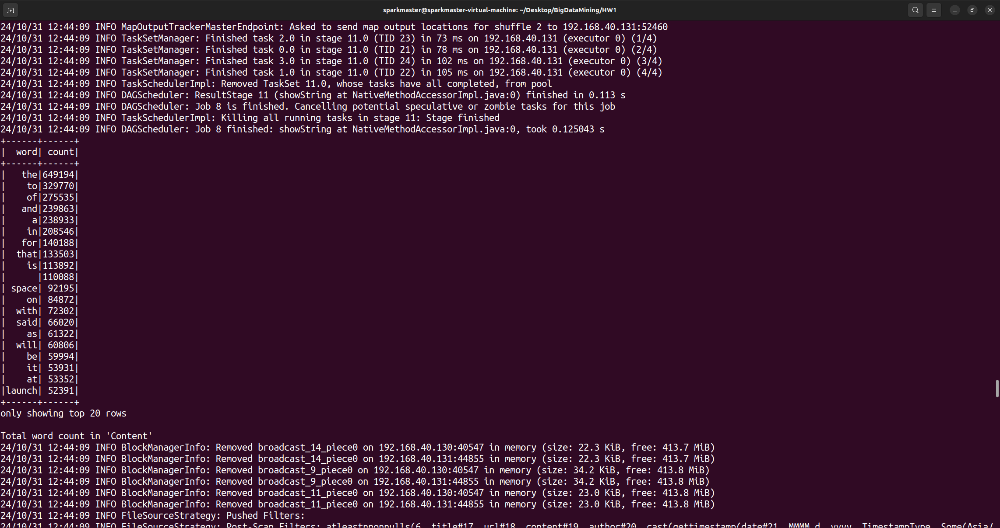
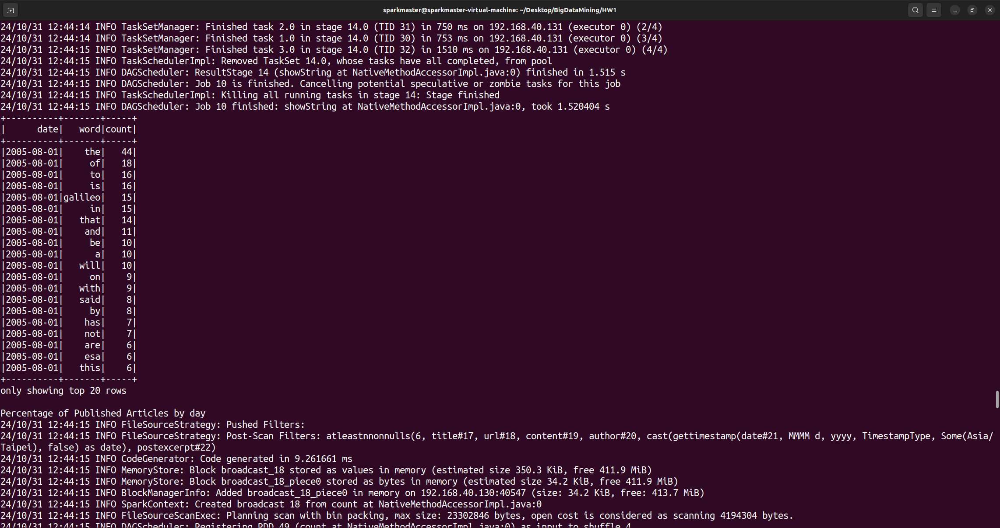
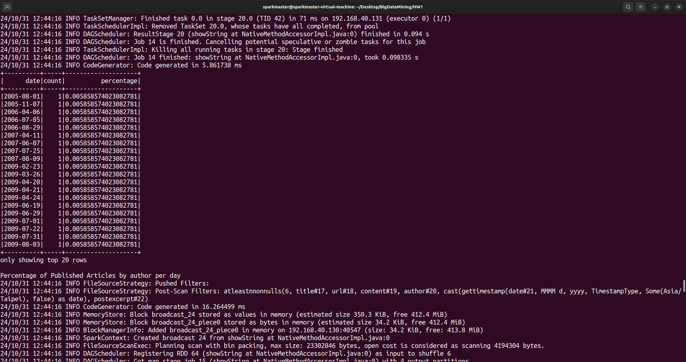
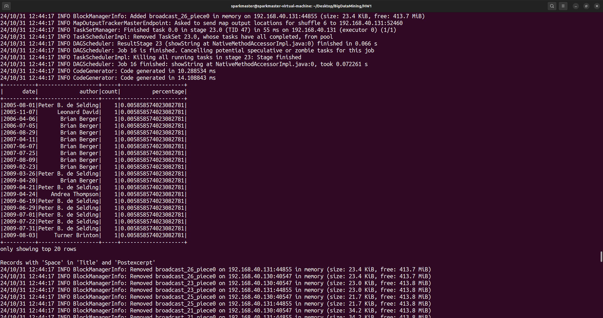
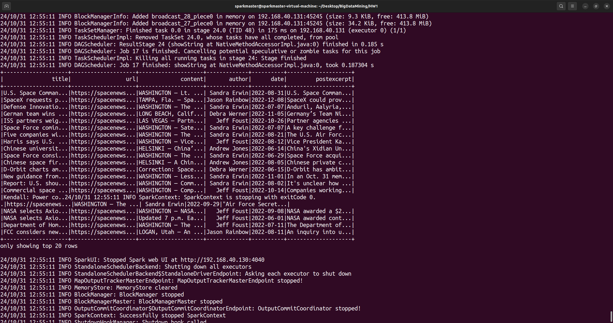
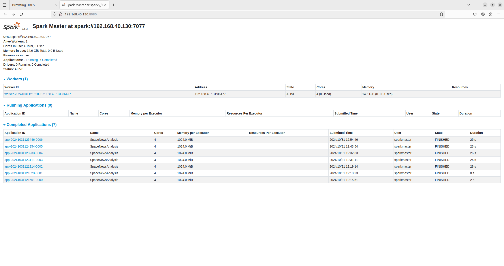
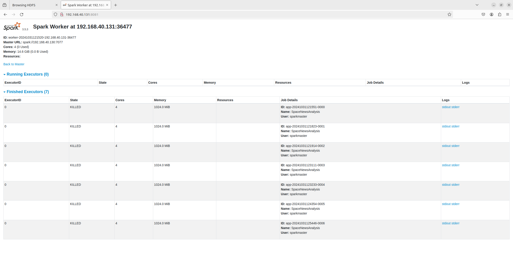

# HW1 
資工四 110590063 蕭宏元

# 環境設定
硬體規格
虛擬機： VMware Workstation
平台： Ubuntu 22.04
CPU 核心數： 4cores
記憶體大小： 16GB

軟體環境
作業系統： Ubuntu 22.04
程式語言： Python 3.10, Java 8

原始碼
```py
from pyspark.sql import SparkSession
from pyspark.sql.functions import col, explode, split, lower, count, desc, to_date, lit
from pyspark.sql.types import StringType

# Initialize Spark session
spark = SparkSession.builder.appName("SpaceNewsAnalysis").getOrCreate()

# Load data from HDFS
df = spark.read.csv("hdfs://192.168.40.130:9000/user/sparkmaster/input/spacenews.csv", header=True, inferSchema=True)

df.show()
# 1. Word Count in 'Title'

# Total word count in 'Title'
print("Total word count in 'Title'")
title_words = df.select(explode(split(lower(col("title")), " ")).alias("word"))
title_word_counts = title_words.groupBy("word").count().orderBy(desc("count"))
title_word_counts.show()

# Daily word count in 'Title'
print("Daily word count in 'Title'")
daily_title_words = df.select(to_date(col("date"), "MMMM d, yyyy").alias("date"), explode(split(lower(col("title")), " ")).alias("word"))
daily_title_word_counts = daily_title_words.groupBy("date", "word").count().orderBy("date", desc("count"))
daily_title_word_counts.show()

# 2. Word Count in 'Content'

# Total word count in 'Content'
print("Total word count in 'Content'")
content_words = df.select(explode(split(lower(col("content")), " ")).alias("word"))
content_word_counts = content_words.groupBy("word").count().orderBy(desc("count"))
content_word_counts.show()

# Daily word count in 'Content'
print("Total word count in 'Content'")
daily_content_words = df.select(to_date(col("date"), "MMMM d, yyyy").alias("date"), explode(split(lower(col("content")), " ")).alias("word"))
daily_content_word_counts = daily_content_words.groupBy("date", "word").count().orderBy("date", desc("count"))
daily_content_word_counts.show()

# 3. Percentage of Published Articles

# Percentage by day
print("Percentage of Published Articles by day")
total_articles = df.count()
daily_article_counts = df.groupBy(to_date(col("date"), "MMMM d, yyyy").alias("date")).count()
daily_article_percentages = daily_article_counts.withColumn("percentage", (col("count") / total_articles) * 100).orderBy("date")
daily_article_percentages.show()

# Percentage by author per day
print("Percentage of Published Articles by author per day")
author_daily_article_counts = df.groupBy(to_date(col("date"), "MMMM d, yyyy").alias("date"), "author").count()
author_daily_article_percentages = author_daily_article_counts.withColumn("percentage", (col("count") / total_articles) * 100).orderBy("date", "author")
author_daily_article_percentages.show()

# 4. Records with "Space" in 'Title' and 'Postexcerpt'

# Filter records
print("Records with 'Space' in 'Title' and 'Postexcerpt'")
space_records = df.filter((lower(col("title")).contains("space")) & (lower(col("postexcerpt")).contains("space")))
space_records.show()

# Stop Spark session
spark.stop()
```

# 執行結果
## 2 sorted lists of top-frequent word
Total word count in 'Title'


Daily word count in 'Title'


Total word count in 'Content'


Daily word count in 'Content'


Percentage of Published Articles by day


Percentage of Published Articles by author per day


Records with 'Space' in 'Title' and 'Postexcerpt'


Master


Worker
